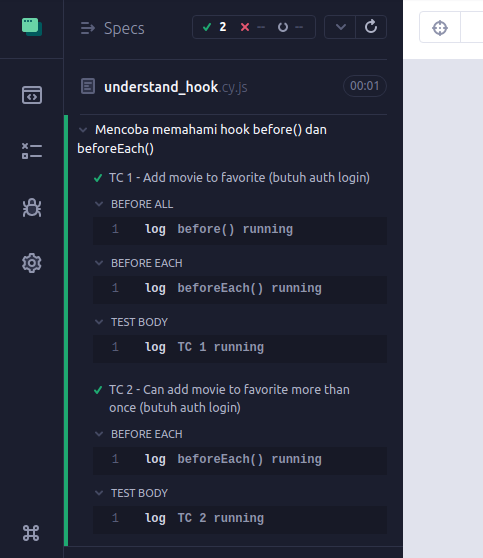
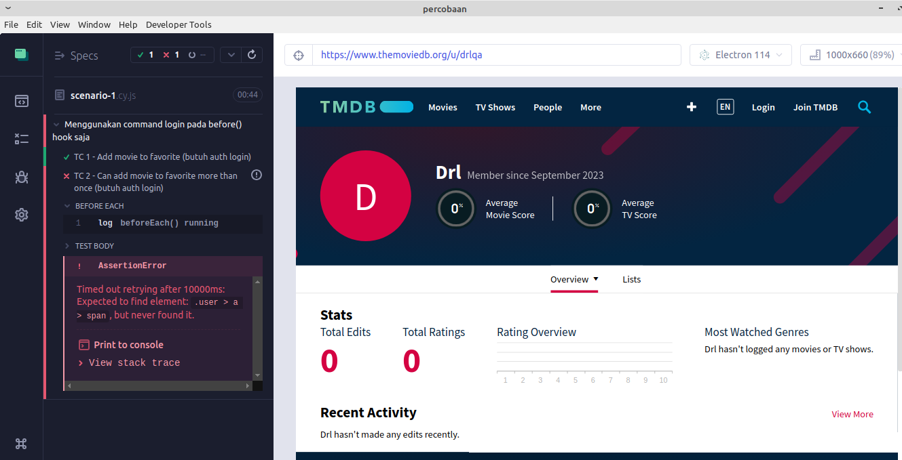
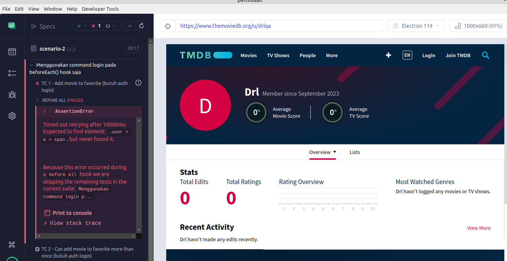
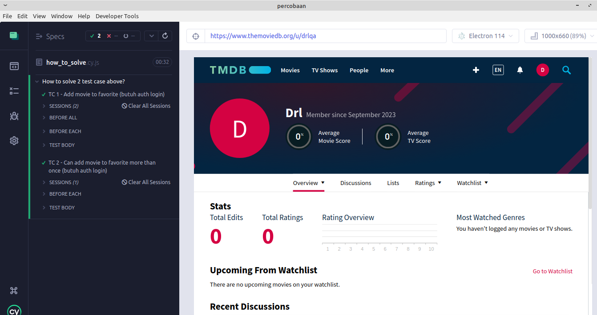
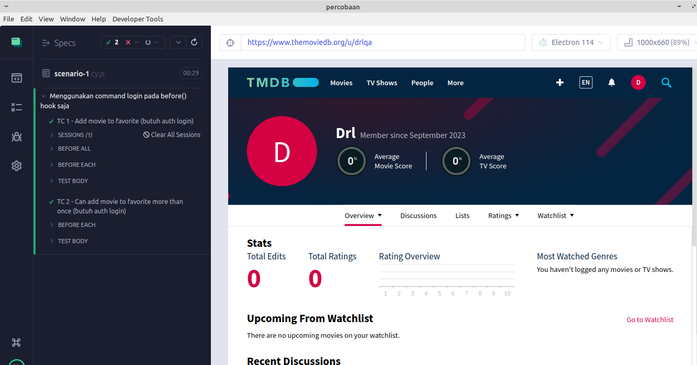
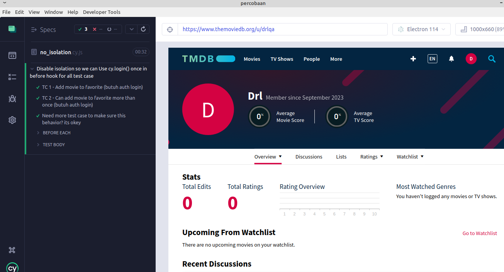

# Dear User

Kemarin kita telah melakukan sedikit diskusi,
dan saya senang bisa diberi kesempatan dalam proses rekrutmen ini, but
entah kenapa saya merasa kurang puas dengan jawaban yang kemarin saya berikan, belum sempat memberikan penjelasan

> karna saya sadar, kemarin sesi kita hanya sebentar

> karna waktu diawal lumayan terbuang karna masalah headset, duh sorry banget ini (awkward ya :D)

dan disini saya akan mencoba menjawab kembali beberapa pertanyaan teknis yang diajukan.
tidak banyak. cukup 3 saja.


### 1. Kenapa assertionnya pakai movie title?

Jawab : karna saya tidak punya akses ke developernya jd ng bisa nanyain apa yg bisa saya
inspect sebagai acuan yg uniq untuk saya gunakan sebagai assertion. saya ketemunya hanya
title. baiknya case seperti ini pakai ID database karna ID sudah pasti uniq

### 2. Kenapa tidak menyertakan pengecekan title kembali dilist favorite pada test case 'user can mark movie as favorite more than once' kenapa hanya menggunakan pengecekan count lebih dari satu, kan bisa saja movienya memang lebih dari satu tetapi bukan movie yg kita add tadi?

Jawab : Karna pada case ini saya fokus untuk memastikan bahwa bisa lebih dari 1, yaitu
dengan mengecek jumlah list, akan tetapi bisa juga seperti saran dari user
yaitu ditambahkan pengecekan title seperti case sebelumnya untuk lebih memastikan apakah movie yg ada dlist benar-benar movie yang kita Mark tadi. sehingga lebih memastikan juga bahwa 'add more than once' itu benar-benar bekerja, menambah assertion bisa lebih membuat yakin apalagi fungsi pengecekannya sudah
ada jdi tinggal kita panggil saja.

### 3. Kenapa menggunakan command cy.login() pada before dan beforeEach hook, apakah tidak redundan? kenapa tidak pakai satu saja entah dibefore atau beforeEach?

begitu kira-kira pertanyaan ke 3

Jawab : Jawaban ketiga ini "TL" tapi semoga saja tidak "TL;DR"
karna disini saya akan mengulasnya secara detail beserta prakteknya. semoga berkenan :)

Tulisan ini dibuat hanya sebagai penjelasan dari codingan saya apakah redundan atau tidak,
sekaligus untuk melengkapi jawaban saya yang kemarin belum puas menjawab karna
kendala waktu yang singkat.

Mari kita mulai !


## The Basic - Memahami run order pada cypress spec file

Sebelumnya kita perlu memahami apa itu hook __before()__ dan __beforeEach()__ dan bagaimana ia bekerja. 
kita akan membuat test sederhana untuk melihat bagaimana cypress
menjalankan hook dan test case 

Mari kita buat code cypress sederhana dengan nama 'understand_hook.cy.js'

```
describe('Mencoba memahami hook before() dan beforeEach()', function(){
	
	before(function(){
		cy.log('before() running')
	})

	beforeEach(function(){
		cy.log('beforeEach() running')
	})

	it('TC 1 - Add movie to favorite (butuh auth login)', function(){
		cy.log('TC 1 running')
		
	})

	it('TC 2 - Can add movie to favorite more than once (butuh auth login)', function(){
		cy.log('TC 2 running')
	
	})
	
})
```
Run dan hasilnya




bisa kita lihat bahwa before hook dijalankan sebelum beforeEach hook

run ordernya seperti berikut

```
- run before
- run beforeEach
- run TC 1
- run beforeEach
- run TC 2
```

sesuai dengan nama functionnya
before() hook dijalankan pertama kali sebelum hook lain dan test case dijalankan, 
setelah itu beforeEach()
kemudian barulah ke test case, lalu lanjut ke beforeEach() lagi
kemudian ke test case berikutnya... begitu seterusnya

## PART 1 : Beberapa percobaan untuk mengetest apakah codenya redundan atau tidak.

Jika code saya redundan karna memanggil command __cy.login()__ pada kedua hook __before()__
dan __beforeEach()__, maka disini saya akan melakukan 2 percobaan/2 scenario.

1. Menggunakan command cy.login() hanya pada hook __before()__ saja
2. Menggunakan command cy.login() hanya pada hook __beforeEach()__ saja


### Membuat scenario automation yang mirip dengan kebutuhan favorite movie.

Terlebih dahulu kita akan menambahkan beberapa code agar kode automation diatas sesuai dengan test scenario pada favorite movie kemarin.

```
describe('Scenario sederhana sesuai favorite movie', function(){
	
	let username = Cypress.env('username')
	let password = Cypress.env('password')

	before(function(){
		cy.log('before() running')

		//action clear list favorite (butuh auth login)
		cy.iHaveLoggedIn()
		
	})

	beforeEach(function(){
		cy.log('beforeEach() running')
	})

	it('TC 1 - Add movie to favorite (butuh auth login)', function(){
		cy.log('TC 1 running')
		cy.iHaveLoggedIn()

	})

	it('TC 2 - Can add movie to favorite more than once (butuh auth login)', function(){
		cy.log('TC 2 running')
		cy.iHaveLoggedIn()
	})


})
```

kode diatas sudah sesuai dengan kebutuhan scenario automation favorite movie
akan tetapi versi sederhananya, meskipun sederhana namun sudah cukup merepresentasikan
scenario automation test pada favorite movie kemarin. fokus percobaan kita adalah
menganalisa redundansi kode pada pemanggilan command cy.login() yg dilakukan 2 kali yaitu di hook __before()__ dan __beforeEach()__

command cy.login() sendiri adalah custom command yg dibuat untuk handling authentikasi user / membuat user dalam keadaan login (state login) 
artinya ketika command tersebut dipanggil, maka status user adalah dalam keadaan logged in (state login)

selanjutnya kita akan membuat command sederhana yg berfungsi melakukan pengecekan apakah user sudah login atau tidak. command tersebut adalah cy.iHaveLoggedIn()

dan isi dari command cy.iHaveLoggedIn() adalah sebagai berikut:
```
Cypress.Commands.add('iHaveLoggedIn', () => {
  
  cy.visit('/u/'+Cypress.env('username'))
  cy.get('.user > a > span')
    .invoke('attr','class')
    .should('contain','avatar')

  /* 
  biasanya untuk pengecekan login atau tidak 
  cukup menggunakan pengecekan cookie session exist
  cy.getCookie('my-session-cookie').should('exist')
  akan tetapi pada case tmdb, cookie tmdb.session selalu exist
  baik diakses sebagai user yg sedang login, atau diakses tanpa login (guest)
  mungkin login atau tidaknya ditentukan dari value cookie tadi, mungkin!
  
  sehingga kita memilih untuk assert user avatar sebagai pengecekan apakah 
  statusnya login atau tidak
  */
  
})
```
maksud dari kode diatas adalah
- jika statenya login dia success
- jika statenya TIDAK login dia throw an error

test akan FAIL jika cy.iHaveLoggedIn() gagal melakukan assertion atau dengan kata lain user TIDAK dalam keadaan login. dan jika user TIDAK dalam keadaan login, artinya
test case tidak dapat dijalankan. karna hampir semua test case pada favorite movie
pre-conditionnya HARUS LOGIN

kode tersebut bisa dilihat di cypress/support/commands.js

### Percobaan 1 - Menggunakan command cy.login() hanya pada hook before() saja, will it work ?

Mari kita mulai percobaan pertama

Menggunakan 1 command __cy.login()__  yaitu pada hook
__before()__ saja.

```
describe('Menggunakan command login pada before() hook saja', function(){
	
	let username = Cypress.env('username')
	let password = Cypress.env('password')

	before(function(){
		cy.log('before() running')
		cy.login(username, password) //hanya 1 command login
		//action clear list favorite (butuh auth login)
		cy.iHaveLoggedIn()
		
	})

	beforeEach(function(){
		cy.log('beforeEach() running')
	})

	it('TC 1 - Add movie to favorite (butuh auth login)', function(){
		cy.log('TC 1 running')
		cy.iHaveLoggedIn()

	})

	it('TC 2 - Can add movie to favorite more than once (butuh auth login)', function(){
		cy.log('TC 2 running')
		cy.iHaveLoggedIn()
	})


})
```
save kode diatas dengan nama scenario-1.cy.js

mari kita run



hasilnya 
TC 1 success TC 2 failed
kenapa demikian?

jawabannya adalah testIsolation, cypress melakukan cleaning up state
dengan menghapus cookie, session, dan localStorage sebelum
menjalankan tiap-tiap test case. 
(nanti kita akan membahas lebih  lanjut tentang testIsolation) 

berikut alur dari kode diatas
```
- run before (do login action untuk kebutuhan clear list favorite)
- run beforeEach test 1
- run TC 1 (success karna mendapatkan state login dari hook before)
- cleaning up state (state login dihapus)
- run beforeEach test 2
- run TC 2 (fail karna state login sudah diclear sebelum tc ini dirun)
```

Percobaan pertama = FAILED

### Percobaan 2 - Menggunakan command cy.login() hanya pada hook beforeEach() saja, will it work ?

Jika pada percobaan pertama diatas FAIL pada test case 2, di percobaan kedua ini kita akan memindah command __cy.login()__ yang terdapat pada __before()__ hook untuk diletakkan pada hook __beforeEach()__, hemmmz kalau merujuk pada code Basic run order cypress diatas, sepertinya ini tidak akan bekerja, benarkah? mari kita coba

berikut kodenya
```
describe('Menggunakan command login pada beforeEach() hook saja', function(){
	
	let username = Cypress.env('username')
	let password = Cypress.env('password')

	before(function(){
		cy.log('before() running')

		//action clear list favorite (butuh auth login)
		cy.iHaveLoggedIn()
	})

	beforeEach(function(){
		cy.log('beforeEach() running')
		cy.login(username, password) //hanya 1 command login tp sekrang di beforeEach
	})

	it('TC 1 - Add movie to favorite (butuh auth login)', function(){
		cy.log('TC 1 running')
		cy.iHaveLoggedIn()
	})

	it('TC 2 - Can add movie to favorite more than once (butuh auth login)', function(){
		cy.log('TC 2 running')
		cy.iHaveLoggedIn()
	})

})
```
save dengan nama scenario-2.cy.js lalu run dan hasilnya 



Failed at the beginning

kenapa demikian?

jelas karna hook __before()__ dijalankan terlebih dahulu sebelum __beforeEach()__, __before()__ butuh state login untuk clear favorite movie, sedangkan command loginnya belum dijalankan karna berada pada hook __beforeEach()__

jadi clear favorite movie dijalankan sebelum login. absolutely FAIL

run order pada script diatas adalah sebagai berikut:
```
- run before (will fail karna di hook ini kita butuh login untuk melakukan clear favorit)
- test will stop
```

Percobaan kedua juga FAILED.

Pada kedua scenario diatas kita telah mencoba agar pemanggilan cy.login() tidak redundan.
yaitu dengan hanya menggunakan 1 command cy.login() saja, 
pertama di hook __before()__ dan kedua di hook __beforeEach()__ dan keduanya FAILED


### How to solve? - gunakan cy.login() pada hook before() dan juga beforeEach() seperti yang sudah di lakukan di favorite movie, so it will work, let's try.

percobaan ketiga mari kita letakkan command __cy.login()__ pada __before()__ dan juga __beforeEach()__
berikut kodenya
```
describe('How to solve 2 test case above?', function(){
	
	let username = Cypress.env('username')
	let password = Cypress.env('password')

	before(function(){
		cy.log('before() running')
		//sertakan login disini, dipakai untuk clearing 
		cy.login(username, password)

		cy.iHaveLoggedIn()
	})

	beforeEach(function(){
		cy.log('beforeEach() running')
		//sertakan login disini, dipakai untuk tiap-tiap test case (yg butuh auth)
		cy.login(username, password)
	})

	it('TC 1 - Add movie to favorite (butuh auth login)', function(){
		cy.log('TC 1 running')
		cy.iHaveLoggedIn()
	})

	it('TC 2 - Can add movie to favorite more than once (butuh auth login)', function(){
		cy.log('TC 2 running')
		cy.iHaveLoggedIn()
	})

})
```

Simpan dengan nama how_to_solve.cy.js kemudian run



SUCCESS...

run order pada Scenario how_to_solve.cy.js adalah sebagai berikut
```
- run before (call cy.login() to do login and then do clear favorite)
- run beforeEach 
(call cy.login(), at the first test case it maybe redundan 
karna tc pertama sudah bisa dapat state login dari before hook, but don't worry we just restored it, 
dan command cy.login() tetap harus dipanggil pada beforeEach() untuk digunakan test case-test case berikutnya)
- run TC 1 (sucess)
- cleaning up state (state login dihapus)
- run beforeEach (again calling cy.login() untuk mendapatkan state login)
- run TC 2 (success karna sudah dapat state login dari beforeEach)
```

Kesimpulannya menggunakan commmand cy.login() dikedua hook __before()__ dan __beforeEach()__ __tidaklah redundan.__ karna keduanya beda peruntukan.

- command cy.login() pada __before()__ hook berfungsi untuk melakukan clear favorie movie
dimana aksi ini hanya kita butuhkan sekali saja selama test berlangsung. ini dilakukan agar ketika test specnya dirun berkali-kali, hasilnya tetap konsisten karna dimulai dari keadaan yang sama yaitu no favorite movie list.

- command cy.login() pada __beforeEach()__ hook berfungsi merestore state login setiap kali test case akan djlankan karna state login sebelmnya telah dihapus oleh testIsolation, __cy.login()__ sengaja dipanggil lagi setiap akan menjalankan test case (beforeEach) untuk mendapatkan state login yang nantinya
digunakan oleh test case yang butuh state tersebut. dan hampir semua test case favorite movie butuh state login kecuali test case 'User can't Mark movie as favorite without login'
itulah alasan kenapa saya menambahkan option { skipBeforeEach: true } pada test case tersebut (diproject favorite movie) agar __cy().login()__ pada beforeEach() tidak dipanggil


## Memahami Test Isolation
by default cypress memberlakukan test isolation,
apa itu test isolation?
cypress melakukan cleaning up state yaitu menghapus cookie, session, dan localStorage sebelum menjalankan tiap-tiap test case sehingga tidak ada ketergantungan atau tidak ada effect antara satu test case dengan test case lainnya
atau dengan kata lain setiap test dimulai dari fresh state, tidak terpengaruh oleh state test case sebelumnya, hal ini dilakukan cypress agar tiap-tiap test case bisa independent.

in our case, statenya adalah auth login, meskipun sebelumnya sudah login di before hook,
akan tetapi cookie, session, dan localStorage akan kembali dihapus sebelum menjalankan test case berikutnya. dan karna semuanya dihapus, maka browser tidak lagi menympan state login

untuk lebih jelasnya bisa dilihat disini
https://docs.cypress.io/guides/core-concepts/test-isolation

penjelasan tambahan
https://docs.cypress.io/api/commands/session

itulah sebabnya kenapa pada Percobaan 1 - (scenario-1-cy.js) FAILED
saat running test case ke 2 (TC 2) karna state login yg dilakukan pada hook __before()__
sudah diclear dan browser kembali ke fresh state (no session/cookie), sehingga kita tetap
perlu memanggil ulang command cy.login() sebelum menjalankan test case-test case berikutnya. yaitu pada hook __beforeEach()__

## PART 2 : [Another preference] Kode diatas bisa redundan.

lho kan diatas sudah dijelaskan kalau tidak redundan, teruss?

pada pembahasan diatas telah dijelaskan __bahwa penggunaan cy.login() pada hook before() dan beforeEach() tidaklah redundan__ karna berbeda peruntukan.
diatas juga sudah dijelaskan terkait testIsolation pada cypress.
akan tetapi __kode tersebut bisa saja redundan apabila testIsolation didisable__


yups...
testIsolation pada cypress tidaklah mutlak, tidak permanent, test isolation dapat di enable (by default) ataupun didisable

itulah alasan kenapa kemarin saya sempat menjawab 'tergantung confignya', 
konfig yg dimaksud adalah testIsolation enable atau disable, 

Apa yang terjadi jika testIsolation di disable?

mari kita coba.

sebelumnya kita harus disable testIsolation dengan menambahkan/uncomment property testIsolation:false pada file cypress.config.js

```
...
e2e: {
    setupNodeEvents(on, config) {
      // implement node event listeners here
    },
    baseUrl : 'https://themoviedb.org',
    testIsolation: false
  },
...
```
save kemudian re-open browser test setelah perubahan tadi (pastikan untuk membuka ulang browser test agar betul betul jalan dengan config baru)

run kembali file scenario-1.cy.js yang FAILED pada mode testIsolation enable tadi

lihat hasilnya.



SUCCESS

kenapa demikian ?

pada mode testIsolation disable cypress TIDAK akan cleaning up state 
atau dengan kata lain tidak menghapus cookie, sessionStorage dan localStorage
sehingga fungsi login bisa kita panggil sekali saja yaitu pada hook before,
dan state login dapat digunakan sepanjang ~~jalan kenangan~~ test spec berjalan

berikut alur dari kode ketika testIsolation disable
```
- run before (do login action untuk kebutuhan clear list favorite)
- run beforeEach test 1
- run TC 1 (success karna mendapatkan state login dari hook before)
- run beforeEach test 2
- run TC 2 (success karna state login dari hook before ttap dipertahankan)
```


mari kita tambahkan 1 test case lagi, untuk lebih meyakinkan apakah benar
state login dipertahankan ketika tesIsolation disable.

berikut full codenya, simpan dengan nama no_isolation.cy.js
```
/*
NOTE:
This scenario will work if you disable testIsolation on your config (by set it to false)
and don't forget to re-opening your test browser/test spec file

*/

describe('Disable isolation so we can Use cy.login() once in before hook for all test case', function(){
	
	let username = Cypress.env('username')
	let password = Cypress.env('password')

	before(function(){
		cy.log('before() running')
		cy.login(username, password)
		//action clear list favorite (butuh auth login)
		cy.iHaveLoggedIn()
		
	})

	beforeEach(function(){
		cy.log('beforeEach() running')
	})

	it('TC 1 - Add movie to favorite (butuh auth login)', function(){
		cy.log('TC 1 running')
		cy.iHaveLoggedIn()

	})

	it('TC 2 - Can add movie to favorite more than once (butuh auth login)', function(){
		cy.log('TC 2 running')
		cy.iHaveLoggedIn()
	})
	
	it('Need more test case to make sure this behavior? its okey ', function(){
		cy.log('TC 3 running')
		cy.iHaveLoggedIn()
	})

})

```

kemudian run dan hasilnya.



Pada kondisi demikian (testIsolation disable) menggunakan cy.login() pada __before__ dan juga __beforeEach__ __adalah redundan__, karna kita cukup gunakan sekali saja yaitu pada hook __before()__

but. another problem. jika testIsolation disable lalu bagaimana dengan test case
'Make sure user cannot mark movie as favorit without logged in'?
test case ini butuh precondition without login

kalau state login tetap dipertahankan lalu bagaimana dong? 
 
bisa dengan menggunakan command clearCookies() pada test case tersebut
dengan command ini maka cookies pada browser akan dihapus, dan state loginpun terhapus

but, we face another problem.

bagaimana dengan test case-test case selanjutnya yg butuh state login? 
seperti contoh test case remove movie from favorite, dimana test ini ada dipaling bawah. 

yapsss... ya kita panggil lagi cy.login() setelah menjalankan test case 'User can't Mark movie as favorite without login'

beberapa problem diatas terjadi saat testIsolation disable, bisa dibandingkan
mana yg lebih mudah? 


- mode enable kita pakai cy.login() di kedua hook before() dan beforeEach() kemudian skip beforeEach() di satu test case tanpa login tersebut

- mode disable kita hanya perlu 1 cy.logn() pada before() hook akan tetapi perlu menambahkan beberapa command pada test case tertentu untuk mengatasi beberapa problem diatas.

Kembali lagi, tergantung preferensi

### Prefer testIsolation enable (default) atau disable?

saya pribadi ikut best practice cypress, yaitu enable testIsolation
https://www.cypress.io/blog/2023/03/08/test-isolation-as-a-best-practice/

akan tetapi sesuai kebutuhan dan real case yang dihadapi.

for example : jika keseluruhan test case butuh state login, maka bisa didisable agar kondisinya tetap dalam keadaan login but ini bukan best practice cypress,
tapi ya santai saja, kembali lagi sesuai preferensi :)

alasan lain kenapa saya prefer testIsolation enable adalah
karna cypress sudah menyiapkan powerfull command yaitu
cy.session(), yaps... betapa powerfullnya command ini sehingga 
masalah autentikasi bisa diatasi dengan mudah

tantangan dalam e2e automation test (khususnya web) salah satunya adalah how to handle authentication. dan cypress menurut saya berhasil to solve this problem dengan cy.session() nya

cy.session() hanya melakukan action login sekali saja.
kemudian command ini akan menyimpan session auth dari action login tadi
sehingga ketika kita membutuhkan state login tersebut cypress akan
merestorenya tanpa perlu melakukan action login berulang.
seperti contoh pada scenario favorite movie, bisa dilihat saat test dijalankan
action login hanya dilakukan sekali saja yaitu sebelum test dimulai (before hook)
kemudian sisanya direstore.

https://www.cypress.io/blog/2021/08/04/authenticate-faster-in-tests-cy-session-command/


## Kesimpulan

Perbedaan Preferensi (dalam hal ini testIsolation enable/disable) dapat menimbulkan
behavior yg berbeda pada cypress, sehingga hasil testpun berbeda.

atau jangan-jangan perbedaannya disebabkan oleh perbedaan versi cypress juga? hal ini bisa saja karna testIsolation dan command cy.session() pada cypress itu implementasinya masih tergolong baru

Test isolation did not truly exist pre-12.
https://docs.cypress.io/guides/references/migration-guide?ref=cypress-io.ghost.io#Simulating-Pre-Test-Isolation-Behavior

sedang fitur cy.session sndri hadir menggantikan command 
Cypress.Cookies.preserveOnce() and Cypress.Cookies.defaults()

kedua command tersebut deprecated pada cypress veris 9-7-0
https://docs.cypress.io/guides/references/changelog#9-7-0
dan removed pada cypress versi 11-0-0
https://docs.cypress.io/guides/references/changelog#11-0-0
sebelum adanya cy.session() kita dapat memelihara state login
dengan kedua fungsi diatas, 
contoh bisa dilihat direpo yg saya buat setahun lalu

https://github.com/drl-repo/cy-wpblog-e2e/tree/main/cypress/integration

automation diatas menggunakan cypress version 9.7.0, dimana cy.session() statusnya masih experiemental.
akan tetapi penggunaan Cypress.Cookies.preserveOnce() and Cypress.Cookies.defaults() tidak semudah pada penggunaan cy.session(),
kemudian cy.session() command fully available pada versi 12-0-0
https://docs.cypress.io/guides/references/changelog#12-0-0


Waahh ternyata bukan hanya soal preferensi testIsolation saja, perbedaan versi juga
dapat menghasilkan berhavior yg berbeda.
mungkin saja versi dan konfigurasi cypress yg digunakan user berbeda dengan yang
saya gunakan.

My Own
- Nodejs v16.13.2 and cypress v13.2.0 (latest version)
- Tested on Electron browser v114 and Google Chrome v107

itulah kenapa saya agak antusias kemarin ketika menjawab pertanyaan nomor 3 diatas
hehe

Menarik........ :)

dan benar statement dari user bahwa ini hanya preferensi saja.
karna didalam software engineering ada banyak cara untuk menyelesaikan 1 masalah.
for example : untuk membuat system login ada banyak sekali contoh code yg bisa dipakai
dan it work right?


Dipersilahkan jika ingin meng-clone project ini didevice masing-masing, sudah saya buat sederhana, hanya pakai package cypress saja. ~~tidak ada package lain yg tak sengaja ikut serta :D~~

Terakhir... Terima kasih banyak sudah meluangkan waktu untuk membaca pembahasan singkat
dan sederhana dari seorang pemula seperti saya

Mohon maaf apabila ada sesuatu yg kurang berkenan, tidak bermaksud untuk menggurui, hanya berusaha menjelaskan code automation yg dibuat oleh seorang newbie, tentu berdasarkan yg saya pahami juga berdasarkan versi dan konfigurasi dari tool yg saya pakai saat ini. Silahkan dikoreksi jika ada yg salah/kurang. saya sangat terbuka untuk masukan.

i hope we can meet again, so can disscuss more an many more about topics like this,
hope we can sharing in a better day with a better headset :(

NOTE: Criticism, suggestions and corrections are very welcome :)


Best Regards

THANK YOU :)